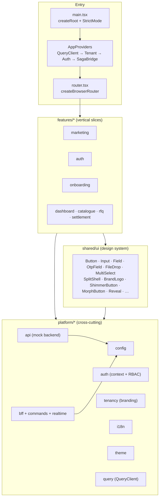
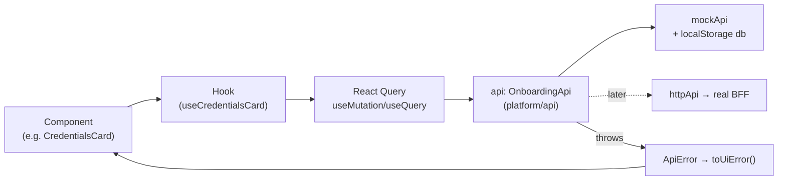
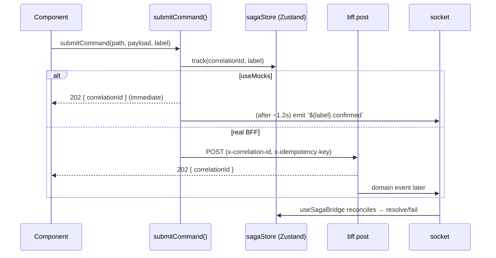
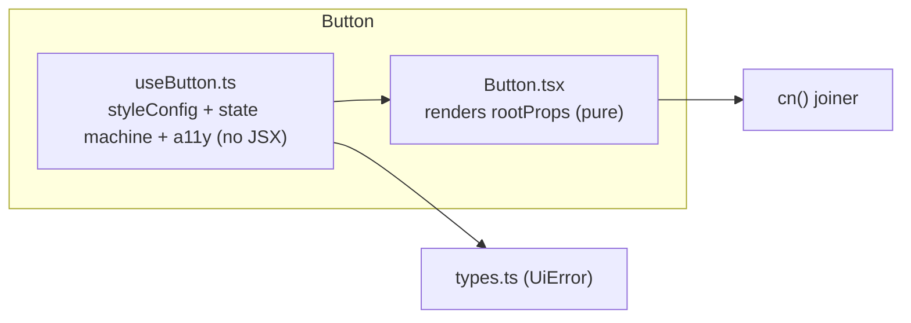
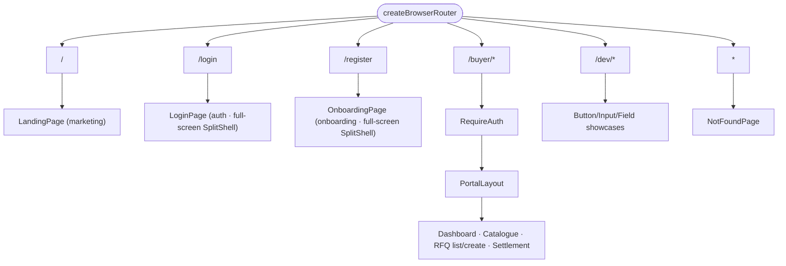
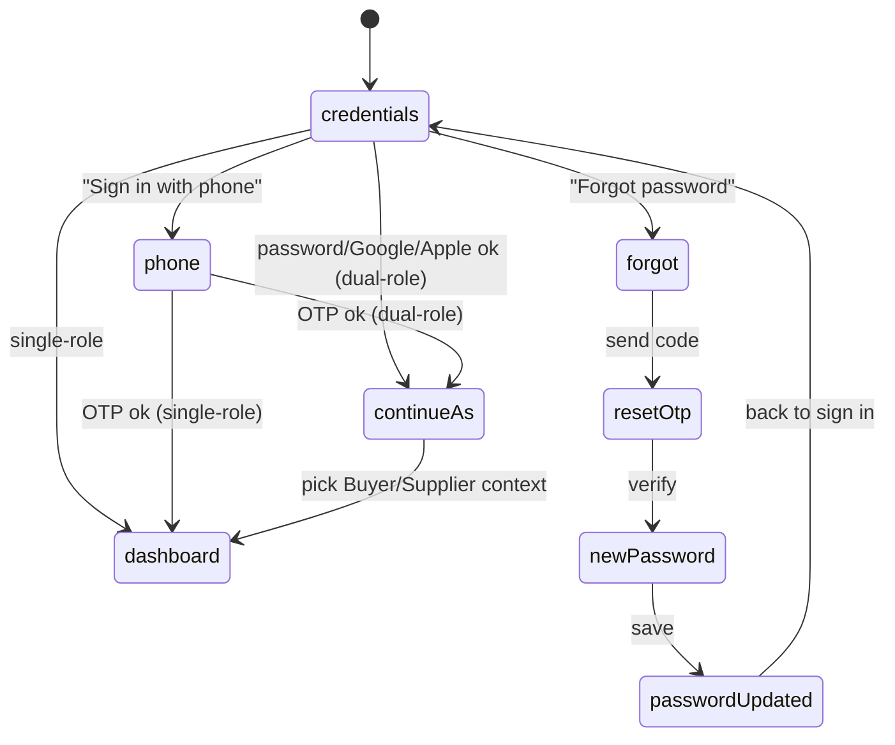
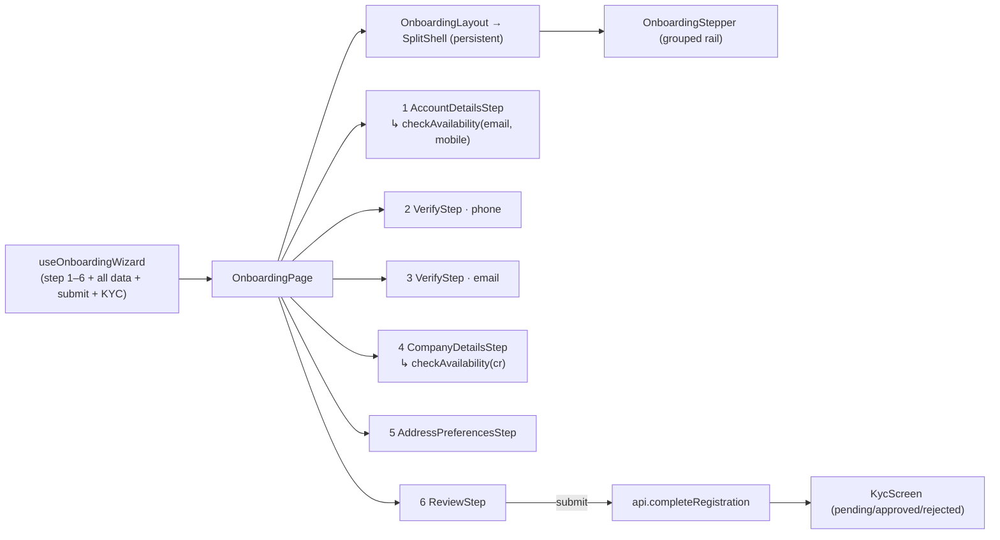
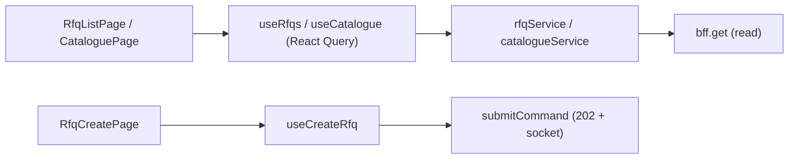

# MI‑Proc — Architecture Summary

A single, comprehensive reference for the frontend as it stands: how it's structured, how
data flows, and what every important file does.

- **Stack:** React 18 + TypeScript, Vite, React Router v6, TanStack Query, Zustand,
  react-hook-form + Zod, i18next (EN/AR + RTL), Tailwind CSS v4 (token-driven).
- **Shape:** feature-sliced SPA. A **platform** layer owns cross-cutting concerns; a
  **shared/ui** layer owns the design system; **features** are vertical slices.
- **Data:** two deliberate paths — a **mock API service layer** (`platform/api`) for
  auth/onboarding, and an **async command/query model** (`platform/bff` + `commands` +
  `realtime`) for the transactional domain (RFQ, catalogue). `useMocks: true` today.

> Diagrams are [Mermaid](https://mermaid.js.org) — open this file's Markdown preview
> (`Ctrl+Shift+V`) to render them.

---

## 1. High-Level Architecture

### 1.1 Layers



### 1.2 Data flow — the two paths

**Path A — Auth & Onboarding (typed mock service layer).** Components call hooks; hooks
call a typed `OnboardingApi` interface; a mock implementation (localStorage-backed) fulfils
it. Swapping to a real BFF later is one line in `platform/api/index.ts`.



**Path B — Transactional domain (async 202 + socket).** Reads go through React Query →
feature service → `bff.get`. Writes are **fire-and-confirm**: the BFF returns `202 Accepted`,
truth arrives later over the socket, and a **saga store** tracks the pending correlation.



---

## 2. Directory Structure

```text
mi-proc/
├─ package.json, vite.config.ts, tsconfig*.json
├─ ARCHITECTURE_SUMMARY.md            ← this file
├─ docs/                              onboarding plan, mock-backend, test plan, architecture map
├─ public/                            favicon, mi-logo.png
└─ src/
   ├─ main.tsx                        app entry (root render)
   ├─ router.tsx                      route table (/login + /register now top-level pages)
   ├─ index.css                       Tailwind v4 @theme tokens (mimony: purple primary / teal secondary), keyframes (+ otp-shimmer), .dark palette
   │
   ├─ app/                            app shell (routing-level)
   │  ├─ providers/AppProviders.tsx   composition root of providers
   │  ├─ layouts/PublicLayout.tsx      unauthenticated shell (header + centered outlet)
   │  ├─ layouts/PortalLayout.tsx      authenticated portal shell (sidebar + topbar)
   │  ├─ components/SiteHeader.tsx      marketing/auth top nav
   │  ├─ components/HeaderNav.tsx       marketing nav links (ShimmerButton)
   │  ├─ portals.ts                    portal → nav config
   │  └─ NotFoundPage.tsx
   │
   ├─ features/                       vertical slices (UI + hooks + services + types)
   │  ├─ marketing/                    landing page (hero, features, audience, cta, footer)
   │  ├─ auth/                         split-shell sign-in (AuthShell + timeline panel), phone-OTP, reset-password flow, social, Nafath
   │  ├─ onboarding/                   6-step register wizard (Account→Verify phone→Verify email→Company→Address→Review) + KYC + Saudi address
   │  ├─ dashboard/  catalogue/  rfq/  settlement/   buyer portal pages
   │
   ├─ platform/                       cross-cutting infrastructure
   │  ├─ api/                          mock backend: contracts, errors, mock/{db,mockApi}
   │  ├─ bff/                          fetch client + ProblemDetails
   │  ├─ commands/                     async write model (commandBus, sagaStore, ids)
   │  ├─ realtime/                     socket client (domain events)
   │  ├─ auth/                         AuthProvider, RBAC roles, RequireAuth guard
   │  ├─ tenancy/                      server-driven branding (whitelabel)
   │  ├─ i18n/                         i18next + en/ar locales + LanguageToggle
   │  ├─ theme/                        ThemeToggle (light/dark)
   │  ├─ query/                        QueryClient
   │  ├─ telemetry.ts, config.ts       runtime config (bff url, socket url, useMocks)
   │
   └─ shared/                         design system + utilities (feature-agnostic)
      ├─ ui/                           Button, Input, Field, OtpField, FileDrop, MultiSelect,
      │                                SplitShell, BrandLogo, ShimmerButton, MorphButton,
      │                                Reveal, RisingBars, TracingBorder, PagePlaceholder, types.ts
      └─ lib/                          cn (classnames), formError
```

---

## 3. Design-system pattern (shared/ui)

Every non-trivial primitive follows the **headless-hook** split: a `use<Name>.ts` owns all
logic (styling resolution, state, a11y, event wiring) and returns prop-getters; the `.tsx`
is a pure presentational shell that spreads them.



| Primitive | Files | Responsibility |
| --- | --- | --- |
| **Button** | `Button.tsx` + `useButton.ts` | Config-driven variants/sizes, async/disabled state machine, typed `error`, click guard |
| **Input** | `Input.tsx` + `useInput.ts` | Native input, click-to-focus, leading/trailing adornments, typed error, outline focus (zero CLS) |
| **Field** | `Field.tsx` + `useField.ts` | Label + Input + helper/error, a11y wiring (htmlFor / aria-describedby / aria-invalid) |
| **OtpField** | `OtpField.tsx` + `useOtpField.ts` + `useOtp.ts` | Segmented **4-digit** code input (auto-advance / backspace / paste) via `useOtpField`; `useOtp` owns code + resend countdown; `loading` overlays a synced `TracingBorder` + `.otp-shimmer` glow. Used by register verify, phone login, reset |
| **FileDrop** | `FileDrop.tsx` + `useFileDrop.ts` | Upload dropzone (click + drag/drop), controlled `fileName`; headless `useFileDrop` |
| **MultiSelect** | `MultiSelect.tsx` + `useMultiSelect.ts` | Chip multiselect with dropdown + outside-click close; self-contained icons |
| **SplitShell** | `SplitShell/*` | Shared two-panel auth/onboarding card (form + gradient panel + top-bar slot); RTL logical-corner sweep. Reused by register (`OnboardingLayout`) **and** sign-in (`AuthShell`) |
| **BrandLogo** | `BrandLogo/*` | **Inline-SVG mimony wordmark** (teal "mi" block + purple "mony" + gradient underline); color / white variants; no image asset |
| **ShimmerButton** | `ShimmerButton.tsx` + `.ts` + `.css` | Spinning conic-mask rim shimmer; `trigger: hover \| click` (one-shot burst) |
| **MorphButton** | `MorphButton/*` | The "Get started" morph CTA (pill expand + label swap); `tone: onDark \| onLight` |
| **Reveal** | `Reveal/*` | IntersectionObserver scroll-in (transform/opacity only; reduced-motion aware) |
| **RisingBars / TracingBorder / PagePlaceholder** | — | Decorative bars, submit-loader border, empty-state placeholder |
| **types.ts** | — | `UiError` — the only error shape any UI component accepts (Pillar 4) |

**Internal logic (representative):** `useButton` splits style-bucket props from DOM props,
resolves Tailwind classes from a literal `styleConfig`, derives `data-state`
(idle/loading/pending/optimistic/error), builds `aria-*`, and guards clicks while busy.
**Dependencies:** `shared/lib/cn`, `shared/ui/types`.

---

## 4. Platform layer (cross-cutting)

### 4.1 `platform/api` — mock backend (auth/onboarding)

| File | Responsibility / Internal logic | Depends on |
| --- | --- | --- |
| `contracts.ts` | The `OnboardingApi` interface + domain types (RegisterInput, LoginResult, OtpChallenge, OrgProfileInput, CompleteRegistrationInput, AvailabilityQuery/Result…). The boundary everything depends on. | `platform/auth` (Portal), `shared/ui/types` |
| `errors.ts` | `ApiError { code, message, field }` + `toUiError()` → maps failures to `UiError` | `shared/ui/types` |
| `mock/db.ts` | localStorage-persisted store (`miproc.mockdb.v1`) + in-memory cache; seeded demo orgs; `reset()` | — |
| `mock/mockApi.ts` | Implements every method with simulated latency + **magic-value errors** (e.g. CR `0000000000` → exists, OTP `1234`) | `db.ts`, `errors.ts` |
| `index.ts` | Exports `api: OnboardingApi = mockApi` (**single swap point**) + `resetDemoData()` | mock impl |

**Methods:** `checkAvailability`, `register`, `verifyOtp`, `resendOtp`, `submitProfile`,
`login`, `requestLoginOtp`, `verifyLoginOtp`, `validateCr`, `validateVat`,
`completeRegistration`.

**Fail-fast uniqueness (`checkAvailability`).** So a taken email/mobile/CR is caught at the
wizard step that *owns* it — not at final submit — `checkAvailability(query)` returns
`'available' | 'taken'` per queried identifier (checked against `mock/db`; CR magic value
`0000000000` reads as taken). It's a **safety net, not the sole guard**: `completeRegistration`
still rejects a value taken mid-session. Fired **once per step on Continue** (not per
keystroke); an unreachable check doesn't trap the user (advance, submit still guards).

### 4.2 `platform/bff` + `commands` + `realtime` — async domain model

| File | Responsibility | Depends on |
| --- | --- | --- |
| `bff/bffClient.ts` | The **only** fetch wrapper; base URL, headers, ProblemDetails parsing → `BffError` | `config`, `problemDetails` |
| `bff/problemDetails.ts` | RFC-7807 → `UiError` mapping | `shared/ui/types` |
| `commands/commandBus.ts` | `submitCommand()` — fire a write, get `202`, track a saga, (mock) emit a confirming socket event later | `bff`, `config`, `realtime`, `sagaStore`, `ids` |
| `commands/sagaStore.ts` | Zustand store of pending correlations (track/resolve/fail) | zustand |
| `commands/useSagaBridge.ts` | Subscribes the saga tracker to socket domain events (reconcile step) | `sagaStore`, `realtime` |
| `realtime/socketClient.ts` | Socket abstraction; `emit`/subscribe for domain events | `config` |

### 4.3 Other platform modules

| Module | Responsibility | Internal logic | Depends on |
| --- | --- | --- | --- |
| `auth/AuthProvider.tsx` | Session context (`user`, `login`, `logout`, `hasRole`) | Mock: `login(portal)` sets a user with that portal's roles | `auth/roles` |
| `auth/roles.ts` | `Portal` (buyer/supplier/back-office/whitelabel) + RBAC `ROLES` map | — | — |
| `auth/guards.tsx` | `RequireAuth` route guard | Redirects unauthenticated users | AuthProvider |
| `tenancy/*` | Server-driven **whitelabel branding** | Applies palette to CSS vars; SWR cache; no-FOUC inline script mirror | `branding.ts`, storage |
| `i18n/*` | i18next init + `en.ts` / `ar.ts` + `LanguageToggle` | Sets `dir`/`lang`; schema messages built from `t` | i18next |
| `theme/ThemeToggle.tsx` | Light/dark toggle | Flips `.dark` on `<html>`, persists to localStorage; token overrides in `index.css` | onboarding icons |
| `query/queryClient.ts` | The shared TanStack `QueryClient` | — | — |
| `config.ts` | Runtime config (`bffBaseUrl`, `socketUrl`, `useMocks`, `googleClientId`) | `getConfig()` returns dev defaults; `useMocks: true` | — |

---

## 5. App shell (`app/`) & routing



- **AppProviders** composition order: `QueryClientProvider → TenantProvider → AuthProvider →
  SagaBridge` (tenancy above auth so branding is in flight before the first authed screen).
- `/login` and `/register` are **standalone full-screen `SplitShell` pages** (own top-bar
  toggles, no `SiteHeader`); `PublicLayout` is now unused. **PortalLayout**: branded sidebar
  nav (`portals.ts`) + topbar + outlet.

---

## 6. Feature: Auth (`features/auth`)

The sign-in flow — a full-screen **`AuthShell`** (shared `SplitShell` + the "How Mi-Proc
works" timeline panel) that stays mounted while the left card swaps. Verify identity
(password / Google / Apple / phone-OTP) → dual-role "Continue as" → dashboard, with a
parallel **reset-password** branch. Register lives in `onboarding` (old register files here
are legacy).



| File | Responsibility | Internal logic | Depends on |
| --- | --- | --- | --- |
| `LoginPage.tsx` | Orchestrates the login step machine (presentational) | One `AuthShell`; swaps card by step (credentials / phone / forgot / resetOtp / newPassword / passwordUpdated / continueAs) | `useLoginFlow`, cards |
| `useLoginFlow.ts` | Step state + routing after auth | steps incl. reset branch + `resetDestination`; `requiresContinueAs` → 'continueAs' else land on portal | `platform/auth`, `platform/api` |
| `components/AuthShell.tsx` | Sign-in shell | Shared `SplitShell` + toggles + `HowItWorksPanel` (purple gradient) | `SplitShell`, `HowItWorksPanel`, toggles |
| `components/AuthFormFrame.tsx` | Left chrome for every auth screen | `BrandLogo` + title/subtitle + optional centered `media` slot | `BrandLogo` |
| `components/HowItWorksPanel.tsx` + `authTimelineIcons.tsx` | Right timeline panel | Requisition→RFQ→Bids→Award→Escrow; staggered `stepper-in` | i18n |
| `components/CredentialsCard.tsx` + `useCredentialsCard.ts` | Email/password sign-in | `api.login`; icon Google/Apple/phone row; Forgot → flow; typed submit error | `api`, `useGoogleSignIn`, `Field`, `Button` |
| `components/PhoneLoginCard.tsx` + `usePhoneLogin.ts` | Passwordless phone-OTP | number → `requestLoginOtp` → 4-digit `OtpField` → `verifyLoginOtp`; resend countdown | `api`, `OtpField`/`useOtp` |
| `components/ForgotPasswordCard.tsx` + `useForgotPassword.ts` | Reset step 1 | Email/SMS channel + destination → mock send → OTP step | `Field`, `Button` |
| `components/ResetOtpCard.tsx` | Reset step 2 | 4-digit `OtpField` verify (mock `1234`) → new password | `OtpField`/`useOtp` |
| `components/NewPasswordCard.tsx` + `useNewPassword.ts` | Reset step 3 | New + confirm (strength + match) → mock save | `Field`, `Button` |
| `components/PasswordUpdatedCard.tsx` | Reset step 4 | Success check + back to sign in | `AuthFormFrame`, `Button` |
| `components/ContinueAsCard.tsx` | Dual-role dashboard-context choice | Role cards → `onSelect(role)` (inside `AuthFormFrame`) | `platform/auth` |
| `useGoogleSignIn.ts` | Real Google Identity Services flow | Loads GSI, token → profile; needs `googleClientId` | `platform/config` |
| `nafath/*` | Nafath (Saudi) sign-in — parked | approve-on-app flow types/hook | — |
| **Legacy** `RegisterPage`, `RegisterFormCard`, `OtpVerifyCard`, `OrgProfileWizard`, `useRegisterForm`, `useOrgProfile`, `useOtpVerify`, `schemas.ts` | Superseded by `onboarding` (route repointed). Kept for reference. | — | — |

---

## 7. Feature: Onboarding (`features/onboarding`) — the register wizard

**The current `/register`.** A persistent two-panel card (the shared **`SplitShell`**) where
**only the left content changes**; the right gradient rail (grouped stepper) stays mounted.
**Six steps in two rail groups** — **CREATE ACCOUNT** (Account details · Verify phone ·
Verify email) and **ORGANIZATION** (Company details · Address & preferences · Review &
submit). Mimony rebrand: purple→teal panel gradient, 4-digit OTP.



| File | Responsibility | Internal logic | Depends on |
| --- | --- | --- | --- |
| `OnboardingPage.tsx` | Orchestrator | One `OnboardingLayout`; swaps children by `wizard.step`/`wizard.kyc`; on finish `login()` + navigate | `useOnboardingWizard`, steps, `platform/auth` |
| `useOnboardingWizard.ts` | Wizard state (no markup) | 6-step data model: fullName, `phoneVerified`/`emailVerified`, role, org + CR/VAT + certificate names, Saudi-address parts, categories; `formatAddress()`; `submit` → `api.completeRegistration` → KYC. **Draft persistence:** saves `{step,data}` to `localStorage` (`miproc.register.draft.v1`) as you go; exposes `resumeAvailable`/`resume`/`startOver`; cleared on submit | `platform/api` (React Query) |
| `components/ResumePrompt.tsx` | Resume gate | Shown when a saved draft exists → Resume (load draft) or Start over (discard); rendered in the same shell so the rail shows prior progress | `StepFrame`, `WizardFooter` |
| `components/OnboardingLayout.tsx` | Shell wrapper | Wraps shared **`SplitShell`**; toggles in top bar; stepper as panel; mimony **purple→teal** gradient; forwards `rejected` | `SplitShell`, `OnboardingStepper`, toggles |
| `components/OnboardingStepper.tsx` | Grouped progress rail | Two groups (CREATE ACCOUNT / ORGANIZATION); done ✓ / current # / upcoming / **error ✗** markers + connectors; staggered `stepper-in` | i18n |
| `components/StepFrame.tsx` | Left chrome | `BrandLogo` + **optional** title + subtitle + scroll body + sticky footer | `BrandLogo` |
| `components/WizardFooter.tsx` | Back/continue footer | Leading back + trailing primary (arrow icon) | `Button`, icons |
| `components/registerIcons.tsx` | Wizard/KYC icon set | Exact Figma Buyer(cart)/Seller(store)/Both(repeat) + upload/chevron/clock/users/sliders/grid/lock/alert/info/warning/check (all `currentColor`) | — |
| `components/steps/AccountDetailsStep.tsx` | Step 1 | Full name/email/mobile/password/confirm/terms; inline validation gates Continue (no role here). On Continue, **email + mobile uniqueness** via `api.checkAvailability` (one call) — a taken value blocks here with an inline error instead of failing at Review; editing a field clears its flag | `Field`, `authIcons`, React Query |
| `components/steps/VerifyStep.tsx` | Steps 2 & 3 | **One component**, `channel='phone' \| 'email'`; 4-digit segmented `OtpField` with **synchronized `TracingBorder` + shimmer loader**; mock code `1234` | `OtpField`/`useOtp`, `Button`, `TracingBorder` |
| `components/steps/CompanyDetailsStep.tsx` | Step 4 | Account-type cards (Buyer/Seller/Both) + org name + CR# + **CR certificate** + VAT# + **VAT certificate** uploads. On Continue, **CR uniqueness** via `api.checkAvailability` blocks a taken CR with an inline error | `Field`, `FileDrop`, registerIcons, React Query |
| `components/steps/AddressPreferencesStep.tsx` | Step 5 | **Saudi National Address** (building 4-digit / additional 4 / zip 5 / unit digits) + categories | `Field`, `MultiSelect` |
| `components/steps/ReviewStep.tsx` | Step 6 | Three summary cards (Account / Verification / Organization profile) + confirm → submit | `WizardFooter` |
| `components/KycScreen.tsx` | Post-submit outcome | **Pending** = centered check + "Next steps" cards (invite / RFQ locked / dashboard); **approved/rejected** notice cards; preview links | `StepFrame`, `WizardFooter`, registerIcons |
| `services/` + `hooks/` + `types/` | WATHQ/CR/VAT contracts (regulatory middleware) | mock-first against typed contracts | — |

> **Removed in the redesign:** `AccountRoleStep`, `OrgProfileStep` (superseded by the six
> steps above). `ValidationCard` is no longer used by the wizard. Account type "Seller" maps
> to internal role `'supplier'` (portals stay buyer/supplier).

---

## 8. Feature: Buyer portal (`dashboard`, `catalogue`, `rfq`, `settlement`)

Standard **service → hook → page** slices; reads via React Query, writes via the command bus.



| Slice | Page | Hook | Service | Notes |
| --- | --- | --- | --- | --- |
| dashboard | `DashboardPage` | — (uses `useAuth`) | — | at-a-glance widgets |
| catalogue | `CataloguePage` | `useCatalogue` | `catalogueService` | certified materials list |
| rfq | `RfqListPage`, `RfqCreatePage` | `useRfqs`, `useCreateRfq` | `rfqService` | create uses async 202 command |
| settlement | `SettlementPage` | — | — | `PagePlaceholder` (Phase 4) |

---

## 9. Cross-cutting rules (always apply)

- **Feature-based architecture** — new code is vertical-sliced under `features/*`; shared
  primitives in `shared/ui`; cross-cutting in `platform/*`.
- **UI/UX pillars** — (1) low cognitive load, (2) 60fps / GPU-only motion (transform +
  opacity; reduced-motion gated), (3) optimistic `setQueryData` (no blind invalidate),
  (4) graceful failure via the typed `UiError` contract.
- **Bilingual + RTL** — every string via i18n keys; logical Tailwind utilities
  (`ms-`, `rounded-ss/ee`, `start-`) so Arabic mirrors correctly.
- **Mock-first** — build against typed contracts (`platform/api`, feature services) so the
  real BFF drops in behind the same boundary.
- **Theming** — semantic tokens in `index.css` `@theme`, CSS-variable-backed → whitelabel
  branding + dark mode reskin at runtime, no rebuild.

---

## 10. Known state / follow-ups

- Two data paths coexist by design: `platform/api` (mock service) for auth/onboarding, and
  `bff`/`commands`/`realtime` (async 202) for the transactional domain.
- **Mimony rebrand** applied in `index.css` `@theme` (`--mp-*`): brand-primary **purple**
  (`#51489E` light / `#857FBB` dark), brand-secondary **teal** (`#00AB98`); `BrandLogo` is an
  inline-SVG wordmark (approximate letterforms — drop the official outlined SVG to make exact).
- **OTP is 4-digit app-wide** (register verify phone/email, phone login, reset); mock demo
  code is **`1234`**. `OtpField` is segmented with a synchronized `TracingBorder` + shimmer.
- Onboarding **Verify** and **Submit** are mock behaviors (`completeRegistration` creates the
  org locally; certificate uploads store the file name only). KYC outcome is a demo preview.
- **Resume:** an interrupted registration is saved to `localStorage` and offered back via the
  ResumePrompt (Resume / Start over). Survives refresh/close; file uploads must be re-attached
  (only names persist). Real File objects and a server-side draft would need the BFF.
- Register step 5 enforces **Saudi National Address** formats (building/additional 4-digit,
  zip 5-digit, unit digits).
- **Fail-fast uniqueness:** step 1 (email + mobile) and step 4 (CR) call
  `api.checkAvailability` on Continue, so an already-registered identifier is caught at its
  own step with an inline error — not at Review. `completeRegistration` stays the backstop
  for a value taken mid-session; an unreachable check advances rather than trapping the user.
- Legacy auth `RegisterPage` + its cards, and `PublicLayout`, are **orphaned**; safe to
  delete when convenient. `src/pages/HomePage.tsx` is not wired into the router.
- Related docs: `docs/onboarding-alignment-plan.md`, `docs/mock-backend.md`,
  `docs/onboarding-test-plan.md`, `docs/architecture.md`.
