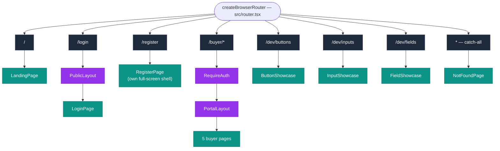
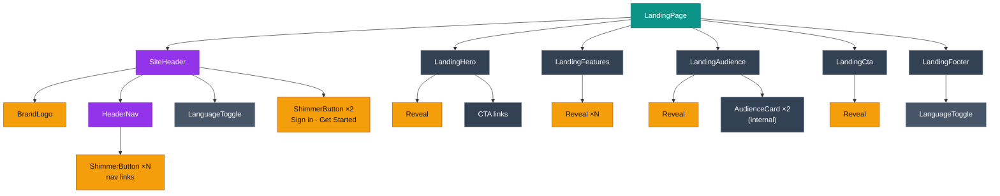
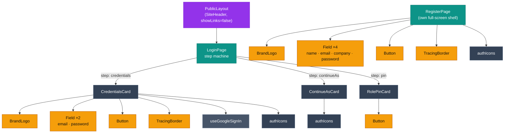
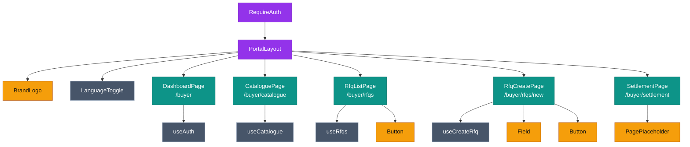
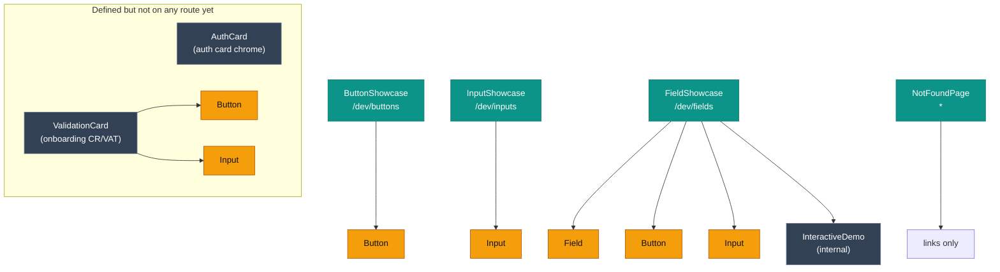

# MI-Proc — Pages, Components & Child Components

A visual map of every route, the page it renders, and that page's component tree down to
shared UI primitives. Generated from the route table (`src/router.tsx`) and the feature
folders under `src/features/*`, `src/app/*`, and `src/shared/ui/*`.

> Diagrams are [Mermaid](https://mermaid.js.org). They render in VS Code's Markdown preview
> and on GitHub. Re-render after changing the component tree.

**Legend**

| Style | Meaning |
| --- | --- |
| 🟦 Route | A path in `createBrowserRouter` |
| 🟩 Page | Top-level routed component |
| 🟪 Layout / chrome | Shell + shared navigation (`PublicLayout`, `PortalLayout`, `SiteHeader`, …) |
| ⬜ Feature component | Component owned by a `src/features/*` slice |
| 🟨 Shared UI | Reusable primitive from `src/shared/ui/*` |
| ⚙️ Platform / hook | Cross-cutting context or data hook (`useAuth`, `useRfqs`, …) |

---

## 1. Route map

How `createBrowserRouter` wires paths to pages, including guards and layout shells.

---

## 2. Landing page (`/`)

---

## 3. Auth — Login (`/login`) & Register (`/register`)

`LoginPage` is a 3-step state machine: it renders exactly one card per step
(verify identity → choose role → enter that role's PIN).

---

## 4. Buyer portal (`/buyer/*`, auth-gated)

`RequireAuth` gates the branch; `PortalLayout` provides the sidebar + topbar shell and
renders one of five pages through its outlet.

---

## 5. Dev showcases, NotFound & unwired components

---

## 6. Shared UI primitives (`src/shared/ui/*`)

The leaf layer. Each is reused across features; this is where the design system lives.

| Primitive | Path | Used by |
| --- | --- | --- |
| `Button` | `Button/Button.tsx` | CredentialsCard, RolePinCard, RegisterPage, RfqListPage, RfqCreatePage, ValidationCard, dev showcases |
| `Input` | `Input/Input.tsx` | Field (internally), ValidationCard, dev showcases |
| `Field` | `Field/Field.tsx` | CredentialsCard, RegisterPage, RfqCreatePage, dev showcase |
| `BrandLogo` | `BrandLogo/BrandLogo.tsx` | SiteHeader, PortalLayout, CredentialsCard, RegisterPage |
| `ShimmerButton` | `ShimmerButton/ShimmerButton.tsx` | HeaderNav (hover), SiteHeader CTAs (click) |
| `Reveal` | `Reveal.tsx` | LandingHero, LandingFeatures, LandingAudience, LandingCta |
| `TracingBorder` | `TracingBorder.tsx` | CredentialsCard, RegisterPage (submit loaders) |
| `PagePlaceholder` | `PagePlaceholder.tsx` | SettlementPage |
| `RisingBars` | `RisingBars/RisingBars.tsx` | _(currently unused — superseded by ShimmerButton in the nav)_ |

---

## 7. Layouts, chrome & platform

| Item | Path | Role |
| --- | --- | --- |
| `PublicLayout` | `src/app/layouts/PublicLayout.tsx` | Unauthenticated shell: `SiteHeader` + centered outlet (login) |
| `PortalLayout` | `src/app/layouts/PortalLayout.tsx` | Authenticated shell: sidebar nav + topbar + outlet (buyer) |
| `SiteHeader` | `src/app/components/SiteHeader.tsx` | Top nav on landing + auth surfaces |
| `HeaderNav` | `src/app/components/HeaderNav.tsx` | Marketing nav links (ShimmerButton) |
| `RequireAuth` | `src/platform/auth/guards.tsx` | Route guard for `/buyer/*` |
| `LanguageToggle` | `src/platform/i18n/LanguageToggle.tsx` | EN/AR + RTL switcher (header & footer) |
| `useAuth`, `useTenant` | `src/platform/*` | Auth + tenant/branding context |
| `useCatalogue`, `useRfqs`, `useCreateRfq`, `useGoogleSignIn` | `src/features/*` | Per-feature data/effect hooks |

---

## 8. Component → file reference

| Component | Path |
| --- | --- |
| LandingPage | `src/features/marketing/LandingPage.tsx` |
| LandingHero / Features / Audience / Cta / Footer | `src/features/marketing/components/*.tsx` |
| LoginPage | `src/features/auth/LoginPage.tsx` |
| CredentialsCard / ContinueAsCard / RolePinCard / AuthCard | `src/features/auth/components/*.tsx` |
| authIcons | `src/features/auth/components/authIcons.tsx` |
| RegisterPage | `src/features/auth/RegisterPage.tsx` |
| DashboardPage | `src/features/dashboard/DashboardPage.tsx` |
| CataloguePage | `src/features/catalogue/CataloguePage.tsx` |
| RfqListPage / RfqCreatePage | `src/features/rfq/*.tsx` |
| SettlementPage | `src/features/settlement/SettlementPage.tsx` |
| ValidationCard | `src/features/onboarding/components/ValidationCard.tsx` |
| ButtonShowcase / InputShowcase / FieldShowcase | `src/dev/*.tsx` |
| NotFoundPage | `src/app/NotFoundPage.tsx` |

> **Note:** child counts like “Field ×2” / “ShimmerButton ×N” denote repeated instances,
> not distinct components. `AuthCard`, `ValidationCard`, and `RisingBars` exist in the
> codebase but aren't wired into any current route.
